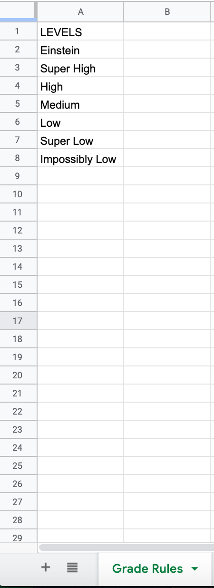
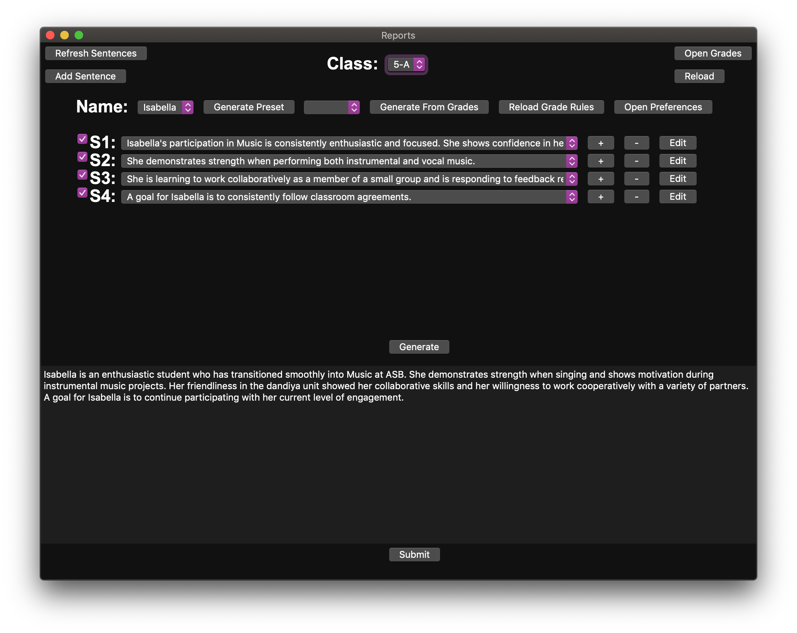

# Report Card Generator (RPG)

RPG is a cross-platform desktop application to automate the process of writing student report cards, in order to make the nightmare that is reports season a little more manageable. 

RPG directly integrates with a Google Sheets backend (with planned support for Excel), in order to easily read from and write to a central repository. This has the added benefit of taking advantage of Drive's Revision History functionality, just in case you lose something precious.

On opening RPG for the first time, the app will prompt for a spreadsheet link, and you should paste in the ID of the spreadsheet you will be using for your reports. In order to utilize RPG, the document must be formatted as follows:

# Classes 

- Each class that you teach should be given its own tab formatted with the grade-level first followed by the name of the class, separated with a hyphen (i.e. KG-Sally, 10-Physics, 10-IB). The linking between class and sentence tab is done via everything BEFORE the hyphen, so it needn't necessarily be grade level, but should convey some meaning. <b>Non-class tabs that contain hyphens will likely crash the program, so do not use hyphens outside of class names</b>
- The first 3 columns of each tab are used for student information that does not change. From left-to-right: First Name, Last Name, Gender
- Student first name and gender are used to populate templates (described below), thus should be filled in accurately before attempting to generate reports. If gender is omitted, they/them pronouns will be used when populating templates
- Column 4 ("D") is where reports are be read from and written to. If a report is already in a student's report cell, the program will read it, otherwise it will remain blank. Any submitted reports will link to the corresponding report cell for a student
- The headers for these first four columns are cosmetic, rather than program-critical. They will not be read by the program, but are nice as reminders nonetheless. <b>This is not true for all other columns</b>
- Column 5 onwards are used for student grades. Each column should be titled with the ASSIGNMENT NAME, followed by a $, followed by the GRADING SCHEME used for that assignment in ALL CAPS (i.e. Test 1$IB). The following grading schemes are defined by default:
    - IB (1-7 scale, with 3 as passing grade)
    - AP (1-5, with 3 as passing grade)
    - PERCENTAGE (0-100, with 60 as passing grade)
    - ALPHABETICAL_WHOLE (F-A, with D as passing grade)
    - ALPHABETICAL_HALF (F-A+, with D as passing grade, and support for + and - on letter grades)
    - ATL (IB ATL scale—DM, AP, ME, EX—with AP as passing grade)
- The rows under this column are assumed to be the student grade for this assignment, with grades assumed to follow the scale of whatever system has been defined (more grading schemes can be defined, as detailed below)
- If done correctly, your sheet should look about like this:

    
    
# Sentences

- Sentence options are arranged into groups based on columns, with each column assumed to be the rough order that a report should flow (i.e. an option from column 1, followed by one from column 2...)
- Sentences are kept in their own tabs, each named "Sentences GRADE", where GRADE represents a grade-level marker for a class (2-M, 2-R, 2-Z would all pull from Sentences 2, KG-1, KG-2 would both pull from Sentences KG, etc)
- <b>This program is designed around quickly writing and saving reports for each student, NOT around creating sentences.</b> Unfortunately, natural language processing has not reached the point where solid-sounding sentences can write themselves, so the bulk of your work will be inputting sentence options, each of which have 3 elements: Text, Templates, and Presets
## **Text**
- Written, plain-text content of a sentence—more or less your classic report card sentences (Student is a joy to have in class, they've really excelled this semester, yada yada)
- Avoid using unconventional symbols—a, because it's a report card, so why the heck would you, but b because they'll likely interfere with...

## **Templates**
- Templates are used to alleviate easy-to-make mistakes when you have dozens, if not hundreds of reports to write. These take the form of symbols or specific strings which are read by the app and replaced with meaningful information:
    - {name} or @: Replaced by student first name
    - {p1} or #: Replaced by subjective pronouns (he, she, they)
    - {p2} or $: Replaced by adjective pronouns (his, her, their)
    - {p3} or %: Replaced by objective pronouns (him, her, them)
    - {p4} or ^: Replaced by possessive pronouns (his, hers, theirs)
- A templated sentence might look like so: @ is a really great addition to the classroom, and # always brings a smile to my face (@ would be replaced by first name, and # by he/her/they)

## **Presets**

- Presets...are where things get a little more complicated. Each sentence can be followed by a preset marker, which denotes a group of sentences which link directly to one another via a specified order. 
- **Currently, this is a manual process**. I'd like to get this automated via the app so that the nitty-gritty isn't what you have to deal with, but for now, sorry.

### Direct Presets

- Direct presets are simple, linear presets. In other words, Sentence 1 in Preset 1 links to Sentence 2 in Preset 1 links to Sentence 3 in Preeset 1...
- **Direct Presets begin with an asterisk (*)**, and have two components to them: Name and Order.
- **Name** is, well, the name of the preset. Preset 1, I Hate Reports, High Achieving...all of these are valid names. Again, don't use symbols at risk of breaking things!
- **Order** is the position in the preset of a specific sentence; if you mark a sentence as being the 2nd thing in Preset 1, then logically it would follow the 1st thing in Preset 1 (or be the first thing if there is no preset marked with a 1). **This order is conveyed with a positive integer**.
- Additionally, these parts are joined via vertical bars—the | character. So, to denote a preset as the second element in Preset 1, the following syntax would be used:
    - Normal sentence text yada yada*Preset 1|2

### Grade-Linked Presets

- Grade-linked presets are a little more complex than direct presets, integrating directly with the grades inputting for a class referencing this specific sentence page. 
- The goal of grade-linked presets is to simplify "ability"-based comments (i.e. does amazing, does decent, does mediocre, does poorly). **Grade-linked presets begin with a tilde (~)** and contain three components: **Assignment**, **Rulesets**, **Priority**.
- **Assignment** is what is sounds like, a reference to specific student assignment. So, Test 1, Test 2...
- **Rulesets** are the meat of grade-linked presets, defining logical expressions based on the grading scheme for an assignment. So, if you wanted different sentences based on if a student got an A, B, a C, or less than that, now you can!
- Rulesets are LOGICAL expressions, therefore use **logical operators**, comparing A to B, where A in the following examples is assumed to be the name of an assignment, and B a grade it is being compared to:
    - A > B: Student grade on A is greater than some grade B
    - A < B: Student grade on A is less than some grade B
    - A >= B: Student grade on A is greater than or equal to B
    - A <= B: Student grade on A is less than or equal to B
    - A == B: Student grade on A is equal to B
- **Priority**: Because conditions are often not mutually exclusive (i.e. Grade > 6 and Grade > 5 are both true if Grade = 7), priority must be specified to define which rules should be considered most important. **Priority is defined for grade-linked presets where order is specificed for a direct preset.** 
- As with direct presets, grade-linked preset components are separated via vertical bar characters, or the |
- Bringing all this together, an example grade-linked preset might ask if a student got a 7 on their IB Calculus Test. Being the highest possible grade, it should be the highest priority, and thus the preset would be:
    - @ showed a real mastery of calculus this semester, achieving a 7 on their final exam~Calculus Test|Calculus Test > 7|1
- **Currently, only one condition can be specified**. A future aim is to be able to chain these together (i.e. 7 on Calculus Test AND 7 on Trigonometry Test could be a rule...)
- Unlike direct presets, which link to one another, **grade-linked presets are a "single" preset**. That is, generating a report based off of grades will result in all grade-based conditions firing to produce the report
- The following is an example sentence page, integrating all of the discussed elements (text in black, templates in purple, grade-linked presets in red, direct presets in orange). Note that grade-linked and direct presets can be applied on the same sentence without interfering with one another:

# Grading Schemes

- Finally, alternate schemes! This is the last element of RPG, and the least necessary, since most common standards are defined by default. But, in case you need to define a custom grading scale, these are for you!
- These are housed in a tab named either Grade Rules or Grade Schemes, with the elements of a scheme stored in a column titled with the name of the scheme
- For example, defining the AP scale as a Grade Scheme would be a column with a header that says AP, and then (in descending order) each element of the scale (5, 4, 3, 2, 1)
- These do not need to be numbers—in fact, this system is primarily designed around that assumption, though numbers work fine. Whatever the ordering of text you put in the cells under each header, that will be considered the order.
- For example, the LEVELS™ scale (it's mine, back off) is defined by the following levels: Einstein, Super High, High, Medium, Low, Super Low, Impossibly Low. As such, the Grade Scheme would look like so:

- These will be loaded into the program when it launches, so can be specified as you would any standard in the header of an assignment (Assignment Name$Scale)

# That's All, Folks

- For now, this is still a work-in-progress. The technical side of things is still very much on-going, and it can't currently be downloading and launched without a bit of technical know-how. Hopefully, a usable version will be up in the next couple of weeks!